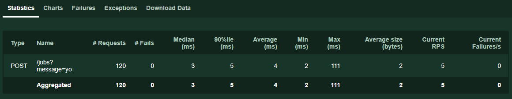
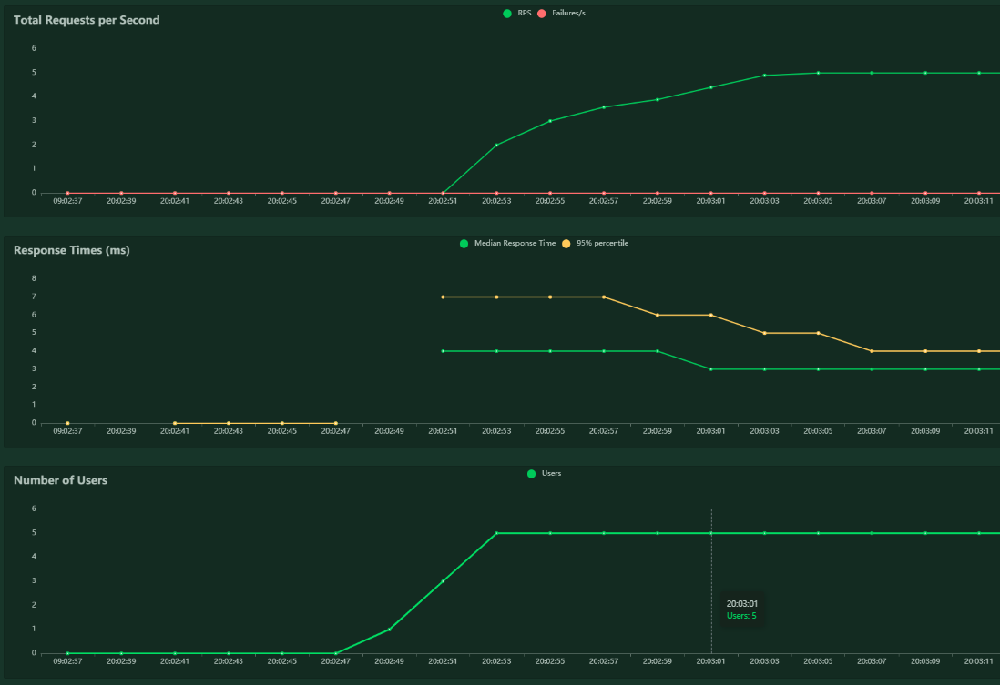
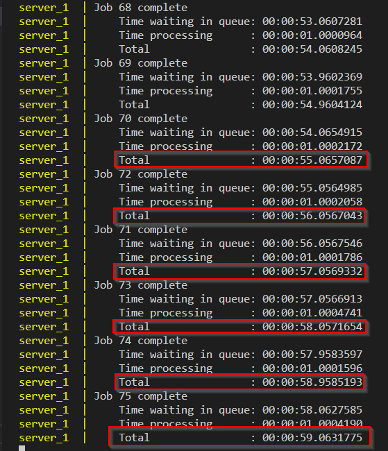

# Locust demo

Runs locust against a dotnet server, using docker-compose.


# Getting started

- install docker

```sh
docker-compose build  # needed after any changes to the server
docker-compose up
```

- browse to localhost:8089
- select any number of users & spawn rate
- set the host to http://server
- click start swarming


# The server

The server has two endpoints:

- `POST /jobs?message=x`: returns a job id
- `GET /jobs/job_id`    : returns the status of the job (new or done)

Jobs are processed by a background worker at a rate of 1 job per second. This
can be changed via the `WORKER_JOB_COMPLETION_RATE_PER_SECOND` environment
variable in `docker-compose.yml`.


# Running different load tests

Change the `command` setting in docker-compose.yml


# Experiments

For all of these experiments, I'm interested in the time it takes to complete a
job. You'll notice in the locust reports that the endpoint response times are
great - a few milliseconds. These are independent of the load on the system.
However, the 'job completed' metric is affected by the load on the system.


## 1 VU creates jobs, waiting for each one to complete
This is only an accurate load test if your users are blocked from performing
actions by a time that is proportional to system load.

@ 5 VUs
- POST /work RPS: 1
- median 'work completed' time: 5s

Note that:
- RPS is the total completed requests per second for that endpoint/operation,
  not per user
- in this scenario, RPS is constrained by the rate that the worker completes
  jobs
- time to complete a job = the number of VUs

Play with the `WORKER_JOB_COMPLETION_RATE_PER_SECOND` in `docker-compose.yml`
to see what effect it has on the above metrics.


## 1 virtual user (VU) creates one job per second
With one user, the worker can keep up, so jobs don't wait for long in the queue.
With any more than one user, the job queue gets longer and longer. The job
completion time is unbounded, and the queue will only shrink once the job
creation rate drops below 1 job per second.

@ 5 VUs
- POST /work RPS: 5
- median 'job completed' time: unbounded, proportional to length of load test
    - this is measured by the server, not locust. See the console output.

All looks fine on the locust dashboard:





However, all is not fine. The work queue is getting longer and longer, and users
have to wait longer for their jobs to complete:


